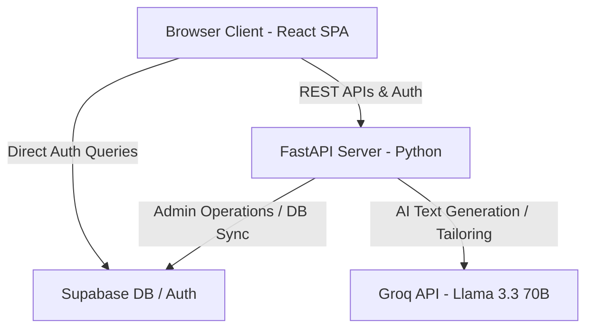
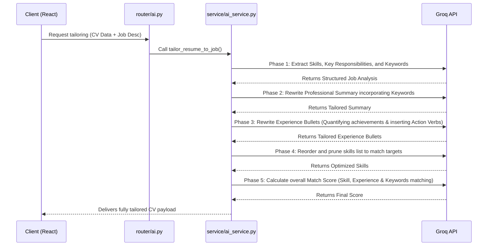

<div align="center">

# Neuroviai Careers

### AI-Powered ATS-Optimized Resume Builder

[](https://reactjs.org/)
[](https://www.typescriptlang.org/)
[](https://fastapi.tiangolo.com/)
[](https://tailwindcss.com/)
[](https://supabase.com/)
[](LICENSE)

**Build professional, ATS-optimized resumes with AI assistance in minutes.**

[Demo](#demo) • [Features](#features) • [Installation](#installation) • [Usage](#usage) • [API](#api-documentation) • [Contributing](#contributing)

</div>

---

## 📋 Table of Contents

- [Features](#-features)
- [Tech Stack](#-tech-stack)
- [Architecture](#-architecture)
- [Installation](#-installation)
- [Configuration](#-configuration)
- [Usage](#-usage)
- [API Documentation](#-api-documentation)
- [Project Structure](#-project-structure)
- [Contributing](#-contributing)
- [License](#-license)

---

## ✨ Features

### Core Features
- **🤖 AI-Powered Content Generation** - Generate professional summaries, experience bullets, and skills using AI
- **📊 ATS Optimization** - Templates designed for 90%+ ATS compatibility scores
- **👁️ Live Preview** - Side-by-side editing with instant preview updates
- **📱 Responsive Design** - Works seamlessly on desktop, tablet, and mobile

### Resume Building
- **🎨 Multiple Templates** - Professional, Tech-focused, Fresher, Data Science, Executive, Creative & more
- **📄 Section Reordering** - Drag and rearrange sections to customize your resume layout
- **💼 Comprehensive Sections** - Personal info, Experience, Education, Skills, Projects, Certifications, Languages
- **🔄 PDF Upload & Parse** - Upload existing resume to auto-populate fields

### Export Options
- **📥 PDF Export** - High-quality PDF with clickable links
- **📝 Word Export** - Microsoft Word compatible format
- **📐 LaTeX Export** - Professional LaTeX templates for academic/technical roles

### Collaboration & Sharing
- **🔗 Shareable Links** - Share your CV with a unique URL
- **👥 Creator Showcase** - Browse CVs shared by the community
- **☁️ Cloud Storage** - All CVs securely stored in the cloud

---

## 🛠️ Tech Stack

### Frontend
| Technology | Purpose |
|------------|---------|
| React 18 | UI Framework |
| TypeScript | Type Safety |
| Vite | Build Tool |
| Tailwind CSS | Styling |
| Lucide Icons | Icons |
| React Router | Navigation |
| html2canvas + jsPDF | PDF Generation |

### Backend
| Technology | Purpose |
|------------|---------|
| FastAPI | API Framework |
| Python 3.11+ | Runtime |
| Uvicorn | ASGI Server |
| Groq API | AI/LLM Integration |
| Supabase | Database & Auth |

---

## 🏗️ Architecture & Workflows

### System Architecture
The platform is designed with a modern, decoupled client-server architecture:



### AI Resume Tailoring Pipeline
When a user provides a job description, the platform optimizes and tailors the resume through a multi-phase AI pipeline:



---

## 📦 Installation

### Prerequisites

- **Node.js** 18+ and npm/yarn/pnpm
- **Python** 3.11+
- **Supabase** account (free tier works)
- **Groq** API key (for AI features)

### 1. Clone the Repository

```bash
git clone https://github.com/JeetInTech/CvForge-Online.git
cd CvForge-Online
```

### 2. Frontend Setup

```bash
# Install dependencies
npm install

# Start development server
npm run dev
```

### 3. Backend Setup

```bash
# Navigate to backend
cd backend

# Create virtual environment
python -m venv venv

# Activate virtual environment
# Windows:
.\venv\Scripts\activate
# macOS/Linux:
source venv/bin/activate

# Install dependencies
pip install -r requirements.txt

# Start backend server
python run.py
```

---

## ⚙️ Configuration

### Environment Variables

Create a `.env` file in the root directory:

```env
# Supabase Configuration
VITE_SUPABASE_URL=your_supabase_project_url
VITE_SUPABASE_ANON_KEY=your_supabase_anon_key

# API Configuration
VITE_API_URL=http://localhost:8000
```

Create a `.env` file in the `backend/` directory:

```env
# Supabase Configuration
SUPABASE_URL=your_supabase_project_url
SUPABASE_KEY=your_supabase_service_key

# AI Configuration
GROQ_API_KEY=your_groq_api_key

# Server Configuration
HOST=0.0.0.0
PORT=8000
DEBUG=true
```

### Database Setup

Run the SQL migrations in your Supabase dashboard:

```bash
# Located in /supabase/migrations/
# Execute in order by timestamp
```

---

## 🚀 Usage

### Development

```bash
# Terminal 1 - Frontend
npm run dev

# Terminal 2 - Backend
cd backend && python run.py
```

### Production Build

```bash
# Build frontend
npm run build

# Preview production build
npm run preview
```

### Available Scripts

| Command | Description |
|---------|-------------|
| `npm run dev` | Start Vite dev server |
| `npm run build` | Build for production |
| `npm run preview` | Preview production build |
| `npm run lint` | Run ESLint |

---

## 📚 API Documentation

### Base URL
```
http://localhost:8000/api
```

### Authentication Endpoints

| Method | Endpoint | Description |
|--------|----------|-------------|
| POST | `/auth/signup` | Create new account |
| POST | `/auth/login` | User login |
| POST | `/auth/logout` | User logout |
| GET | `/auth/me` | Get current user |

### CV Endpoints

| Method | Endpoint | Description |
|--------|----------|-------------|
| GET | `/cv` | List all user CVs |
| GET | `/cv/:id` | Get specific CV |
| POST | `/cv` | Create new CV |
| PUT | `/cv/:id` | Update CV |
| DELETE | `/cv/:id` | Delete CV |

### AI Endpoints

| Method | Endpoint | Description |
|--------|----------|-------------|
| POST | `/ai/generate-summary` | Generate professional summary |
| POST | `/ai/enhance-text` | Enhance existing text |
| POST | `/ai/generate-skills` | Generate relevant skills |
| POST | `/ai/generate-bullets` | Generate experience bullets |
| POST | `/ai/suggest-improvements` | Get CV improvement suggestions |
| POST | `/ai/tailor-resume` | Tailor resume to a job description |

### Document Endpoints

| Method | Endpoint | Description |
|--------|----------|-------------|
| POST | `/document/parse` | Parse uploaded PDF or DOCX resume |

---

## 📁 Project Structure

```
cv-forge/
├── 📂 src/                    # Frontend source code
│   ├── 📂 components/         # React components
│   │   ├── 📂 templates/      # CV template components
│   │   ├── DocumentUpload.tsx
│   │   ├── Navbar.tsx
│   │   ├── ShareCVDialog.tsx
│   │   └── TemplateSelector.tsx
│   ├── 📂 contexts/           # React contexts
│   │   └── AuthContext.tsx
│   ├── 📂 lib/                # Utilities & API clients
│   │   ├── api.ts
│   │   ├── ai-api.ts
│   │   ├── supabase.ts
│   │   └── latex-generator.ts
│   ├── 📂 pages/              # Page components
│   │   ├── Home.tsx
│   │   ├── CVEditor.tsx
│   │   ├── CVEditorAI.tsx
│   │   ├── Portfolio.tsx
│   │   └── ...
│   ├── App.tsx                # Root component
│   └── main.tsx               # Entry point
├── 📂 backend/                # Python backend
│   ├── 📂 app/
│   │   ├── 📂 routers/        # API route handlers
│   │   │   ├── ai.py
│   │   │   ├── auth.py
│   │   │   ├── cv.py
│   │   │   └── document.py
│   │   ├── 📂 services/       # Business logic
│   │   │   └── ai_service.py
│   │   ├── config.py
│   │   ├── database.py
│   │   ├── main.py
│   │   └── models.py
│   ├── requirements.txt
│   └── run.py
├── 📂 supabase/               # Database migrations
│   └── 📂 migrations/
├── 📄 package.json
├── 📄 tailwind.config.cjs
├── 📄 vite.config.ts
├── 📄 tsconfig.json
└── 📄 README.md
```

---

## 🤝 Contributing

We welcome contributions! Please follow these steps:

1. **Fork** the repository
2. **Create** a feature branch (`git checkout -b feature/amazing-feature`)
3. **Commit** your changes (`git commit -m 'Add amazing feature'`)
4. **Push** to the branch (`git push origin feature/amazing-feature`)
5. **Open** a Pull Request

### Development Guidelines

- Follow existing code style and conventions
- Write meaningful commit messages
- Add comments for complex logic
- Update documentation as needed
- Test your changes thoroughly

---

## 📄 License

**© 2026 JeetInTech. All Rights Reserved.**

This project is proprietary software. Unauthorized copying, modification, distribution, or use of this software is strictly prohibited. See the [LICENSE](LICENSE) file for details.

⚠️ **No permission is granted to copy, modify, or distribute this software without explicit written consent from the owner.**

---

## 🙏 Acknowledgments

- [Lucide Icons](https://lucide.dev/) - Beautiful open-source icons
- [Tailwind CSS](https://tailwindcss.com/) - Utility-first CSS framework
- [Supabase](https://supabase.com/) - Open source Firebase alternative
- [Groq](https://groq.com/) - Fast AI inference

---

<div align="center">

**Made with ❤️ by [JeetInTech](https://github.com/JeetInTech)**

⭐ Star this repo if you find it helpful!

</div>
