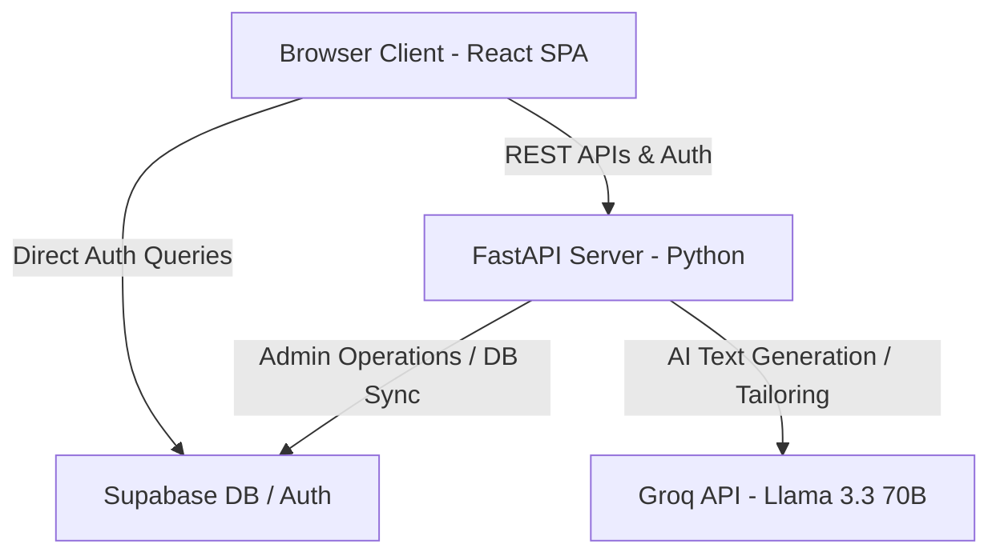
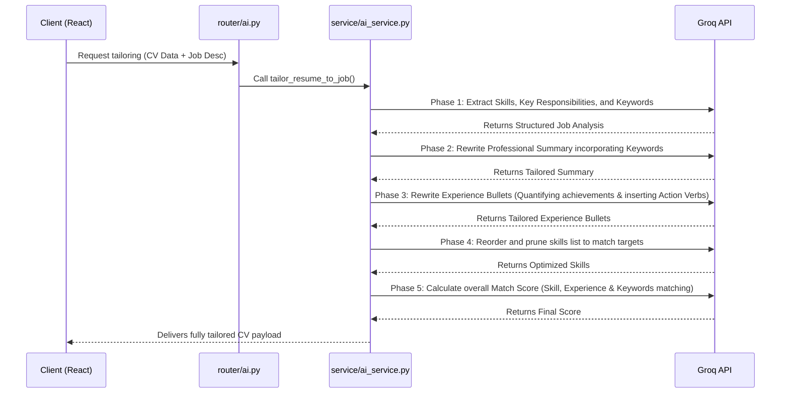

# CV Forge / Neurovia Careers - Codebase Context Reference

This document provides a highly detailed architectural, technical, and structural breakdown of the **CV Forge / Neurovia Careers** codebase based on a deep scan of its directories.

---

## 🏗️ Architectural Overview

CV Forge is a premium, AI-assisted, ATS-optimized resume builder that compiles resumes in multiple customizable formats, parses existing PDFs/DOCXs, and exports high-fidelity LaTeX or PDF outputs.



---

## 📂 Core Tech Stack

| Layer | Technologies | Description |
| :--- | :--- | :--- |
| **Frontend** | React 18, TypeScript, Vite, Tailwind CSS, Lucide Icons, React Router v6 | Premium UI utilizing glassmorphism, smooth animations, and active state monitoring. |
| **Backend** | Python 3.11+, FastAPI, Uvicorn | High-performance async API processing. |
| **Database & Auth** | Supabase (PostgreSQL), Supabase Auth | User profile persistence, CV JSON storage, secure credit management, and metadata. |
| **Document Processing** | `pdfplumber`, `python-docx` | Advanced extraction and section-matching layout analysis. |
| **AI Integration** | Groq Python SDK (`llama-3.3-70b-versatile`) | Rapid inference for professional summary, skill, bullet generation, and resume-to-job tailoring. |
| **Exporting & Rendering** | Custom LaTeX generator Engine, `html2canvas`, `jsPDF`, `html2pdf.js` | Direct compilable LaTeX generation or canvas-based client PDFs. |

---

## 📁 Key File Map & Code Organization

### Frontend Structure (`/src`)
- [App.tsx](file:///e:/Zen/projects/2026%20-%20PROJECTS/Neuroviai-Careers/src/App.tsx): Entry routing, global `ErrorBoundary` protection, and `AuthProvider` configuration.
- [src/pages/CVEditorAI.tsx](file:///e:/Zen/projects/2026%20-%20PROJECTS/Neuroviai-Careers/src/pages/CVEditorAI.tsx): The core resume builder page (101KB). Supports:
  - Collapsible forms for sections (`PersonalInfo`, `Education`, `Experience`, `Skills`, `Projects`, `Certifications`, `Languages`).
  - Interactive AI integration (one-click generate or enhance).
  - Side-by-side live compilation and document preview.
  - Advanced section reordering and accent color customizers.
  - Adaptive 1.5-second debounced Auto-Save.
- [src/lib/database.types.ts](file:///e:/Zen/projects/2026%20-%20PROJECTS/Neuroviai-Careers/src/lib/database.types.ts): Unified TypeScript types for the CV object schema, ATS recommendations, and LaTeX exports.
- [src/lib/latex-generator.ts](file:///e:/Zen/projects/2026%20-%20PROJECTS/Neuroviai-Careers/src/lib/latex-generator.ts): Heavyweight LaTeX string compiler mapping user inputs into templates.

### Backend Structure (`/backend`)
- [backend/main.py](file:///e:/Zen/projects/2026%20-%20PROJECTS/Neuroviai-Careers/backend/main.py): Root entry point. Sets up CORS configuration and aggregates routers.
- [backend/app/routers/ai.py](file:///e:/Zen/projects/2026%20-%20PROJECTS/Neuroviai-Careers/backend/app/routers/ai.py): FastAPI paths mapping AI interactions (`/ai/generate-summary`, `/ai/generate-bullets`, `/ai/enhance-text`, `/ai/suggest-improvements`, and `/ai/tailor-resume`).
- [backend/app/services/ai_service.py](file:///e:/Zen/projects/2026%20-%20PROJECTS/Neuroviai-Careers/backend/app/services/ai_service.py): Core prompt engineering layer wrapping Groq completions.
- [backend/app/routers/ats.py](file:///e:/Zen/projects/2026%20-%20PROJECTS/Neuroviai-Careers/backend/app/routers/ats.py): Algorithmic ATS scoring. Calculates weightings:
  - **40% Keyword Match**: Cross-references resume strings with custom role-specific keyword databases (`ROLE_KEYWORDS`) or user-inputted job descriptions.
  - **30% Formatting completeness**: Penalizes short summaries, missing locations, or sparse experience bullet counts.
  - **30% Content quality**: Checks for action verbs and numerical/quantified achievements (via regex parsing).
- [backend/app/routers/document.py](file:///e:/Zen/projects/2026%20-%20PROJECTS/Neuroviai-Careers/backend/app/routers/document.py): Sophisticated PDF/DOCX text-to-JSON extractor. Combines regex section matching (via `SECTION_HEADERS`) with fallback LLM enhancement (`parse_cv_with_ai`) to achieve high accuracy CV imports.

---

## 📊 Database Schema Summary

The relational database is split into two primary core tables:

### 1. `profiles`
Tracks user details, remaining developer/credits, and paid subscription plans.
```sql
profiles (
  id uuid PRIMARY KEY,
  email text,
  username text UNIQUE,
  display_name text,
  avatar_url text,
  cv_credits integer DEFAULT 2,
  subscription_status enum('free', 'premium', 'enterprise')
)
```

### 2. `cvs`
Stores the complete state of a user's resume in highly querying-efficient PostgreSQL JSONB objects.
```sql
cvs (
  id uuid PRIMARY KEY,
  user_id uuid REFERENCES profiles,
  template text,
  target_role text,
  ats_score integer,
  personal_info jsonb,
  education jsonb[],
  experience jsonb[],
  skills jsonb[],
  languages jsonb[],
  certifications jsonb[],
  projects jsonb[],
  created_at timestamp,
  updated_at timestamp
)
```

---

## 🤖 Deep Dive: AI Tailoring Pipeline

When a user provides a job description, `/ai/tailor-resume` executes the following sequence:



---

> [!NOTE]
> **Vite Config and CLI Dev Server Status**
> The Vite Dev Server (`npm run dev`) successfully boots and establishes a local listener at `http://localhost:5173/`. 
> Note that continuous integration environments or background terminal hooks might sometimes report a simulated non-zero exit code if the server is forcibly interrupted, but the build systems and dependencies are fully operational.
